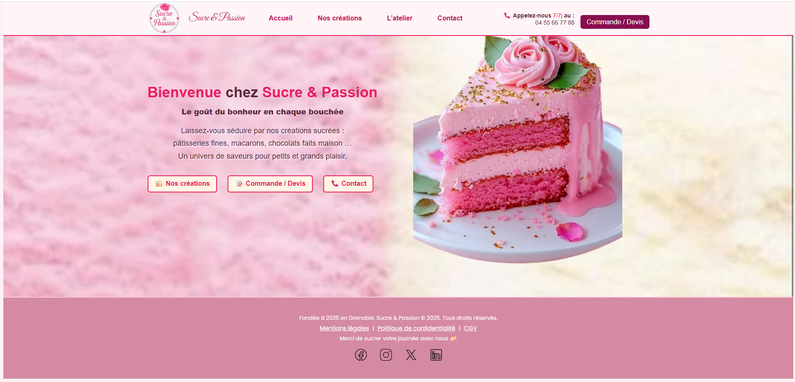

# 🍰 Site Vitrine – Univers Sucré

Bienvenue dans ce projet de site vitrine réalisé dans le cadre de ma formation. Ce site met en lumière l’univers raffiné d’une pâtisserie artisanale à travers différentes créations sucrées.

---

## 🎯 Objectifs

- Mettre en valeur les créations pâtissières à travers un site HTML/CSS
- Structurer les pages par catégorie de produits
- Utiliser un design épuré, responsive et attractif
- Proposer une navigation fluide entre les sections

---

## 📁 Arborescence du projet

```bash
📂 PÂTISSERIEWEB/
├── Accueil/
├── Nos-creations/
│   ├── Patisseries-classiques/
│   ├── Gateaux-personnalises/
│   ├── Macarons-mignardises/
│   ├── Chocolats-confiseries/
│   ├── Viennoiseries/
│   └── Gouters-douceurs/
├── Atelier/
├── Contact/
├── Commande-Devis/
└── Images/

```

Chaque dossier contient une page `.html` et éventuellement des fichiers CSS ou images liés.

---

## 🧁 Pages principales

- **Accueil** : Introduction à la pâtisserie
- **Nos créations** : Vue d’ensemble de toutes les catégories
- **Catégories spécifiques** :  
  - Gâteaux personnalisés  
  - Macarons & mignardises  
  - Chocolats & confiseries  
  - Goûters & douceurs  
  - Pâtisseries classiques  
  - Viennoiseries
- **Atelier** : Présentation de l'équipe ou du lieu de fabrication
- **Commande-Demande** : Informations pour passer une commande
- **Contact** : Coordonnées et formulaire

---

## 🛠️ Technologies utilisées

- HTML5
- CSS3
- Google Fonts
- Canva (pour certaines illustrations)

---

## 📱 Responsive Design

Le site s’adapte aux différents écrans (ordinateur, tablette, smartphone) grâce à l’utilisation de **Flexbox**, **Grid**, et de **media queries**.

---

## 📸 Aperçu


---

## 📚 Apprentissage

Ce projet m’a permis de :

- Structurer un projet web multi-pages
- Améliorer mes compétences en mise en page CSS
- Comprendre les bonnes pratiques pour un site vitrine

---


## 🔗 Lien du projet
[👉 Voir le projet en ligne](https://example.com)

---

## 👩‍💻 Auteur
- **Shadah HASSAN-ABDALLAH**

✨ *Merci de visiter cet univers sucré !*
